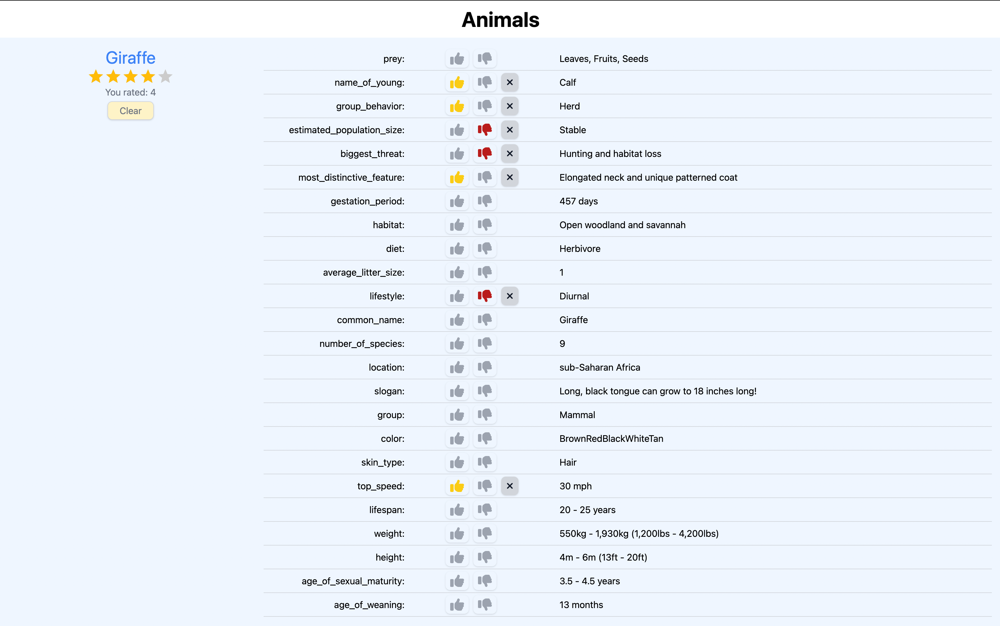
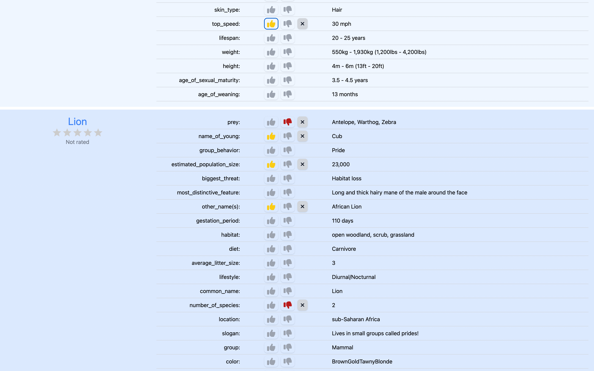
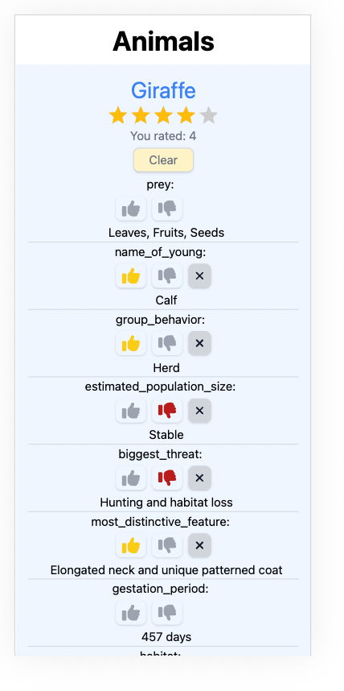
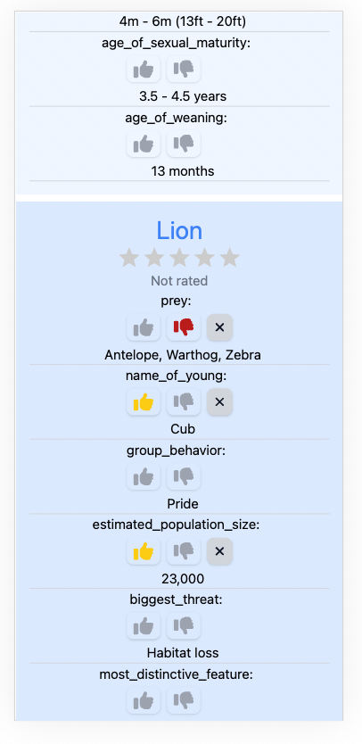

# Animals
The story is that our customer organises trips to wild places where user's favourite animals can be seen. So, people can rate animals and our customer can automatically suggest the perfect trip for the user according to user's preferences.

## First stage of the roadmap
The application is in the first stage of development, and its goal is to create functionality for rating animals and assessing their characteristics (like/dislike).

**Mast have:** 1-3 stories\
**Improvements:** 4-7 stories\
**Nice to have:** 8-9 stories

## Stories
1. As a user, I want to be able to see the list of animals with characteristics.
   - Display the list of animals\
     Let’s assume that we can hardcode the list of animals, because it won’t be changed a lot in the near future. So, we can skip functionality for adding animals, storing them, etc.
   - Display the characteristics for each animal\
     We have an API with given characteristics made by professionals, so we have to use it.\
     Create the simplest solutions to handle states: loading indicator, empty state, error state (will be improved later)
   - Animals won’t be updated frequently, there is no need to fetch it all the time.
     Store the list of animals in localStorage.\
     Use stored list if it’s not expired (e.g. 5 min)
2. As a user, I want to be able to rate/unrate each animal in the list
   - Create Rating component and add it for each animal
   - Add Clear button to be able to unrate an animal
   - Save the list of rated animals in localStorage and use it to display rating after re-render/page loading
3. As a user, I want to be able to like/dislike characteristics of each animal
   - Create and add Like/Dislike functionality for each characteristic.
     The animal rating isn’t related to it’s characteristics. The animal can stay unrated, but have rated characteristics.
     User should be able to see their rating (like/dislike should be shown to the user)
   - Add Clear button to be able to unrate a characteristic
   - Save the list of rated characteristics in localStorage and use it to display rating after re-render/page loading (map it with stored rated animals)
4. As a user, I want to see better visual representation of application states
   - Loading states
   - Empty state (e.g. no characteristics)
   - Error states
5. As a user, I want the application to be stable
   - Cover the main functionality with tests
6. As a user, I want to experience better UI/UX (unfortunately, designers couldn’t join from the beginning, so now it’s time for improvements)
   - Align design (mobile and desktop) with UI/UX improved by design team (create small design system with palette and typography)
   - Check and improve A11y
7. As a user, I want to sort and filter the list of animals by …
   - Add sorting (A-Z, rating)
   - Add filters (rated/unrated animals, rated by…, filter by name)
8. As a user, I want to see the data faster
   - Add pagination or lazy loading => change stored lists
9. As an admin, I want to be able to manage animals
   - Create and use an API with animals instead of hardcoded file (think about using useQuery or Routing to handle fetching and caching)
   - Add routing to manage different pages (e.g. view/rate animals, add animals)
   - Move Animals displaying logic to a separate page
   - Create Add Animals page (if use more icons, then check if it’s easier to use icons library instead of imported icons)

# Technologies
1. React + TypeScript + Vite
2. Tailwind + Styled-Components (SC were added more as an example how to combine with Tailwind. Can be very helpful for further development)
3. Vitest + ReactTestingLibrary + MSW (for API mocks)

# How to run
1. Add .env file to the root of the project with your key for https://api-ninjas.com/ \
   It should be called **VITE_API_KEY=** your-api-ninjas-key
2. run: **npm install**
3. run: **npm run dev**

# Screenshots
## Desktop view



## Mobile view



# React + TypeScript + Vite

This template provides a minimal setup to get React working in Vite with HMR and some ESLint rules.

Currently, two official plugins are available:

- [@vitejs/plugin-react](https://github.com/vitejs/vite-plugin-react/blob/main/packages/plugin-react/README.md) uses [Babel](https://babeljs.io/) for Fast Refresh
- [@vitejs/plugin-react-swc](https://github.com/vitejs/vite-plugin-react-swc) uses [SWC](https://swc.rs/) for Fast Refresh

## Expanding the ESLint configuration

If you are developing a production application, we recommend updating the configuration to enable type aware lint rules:

- Configure the top-level `parserOptions` property like this:

```js
export default {
  // other rules...
  parserOptions: {
    ecmaVersion: 'latest',
    sourceType: 'module',
    project: ['./tsconfig.json', './tsconfig.node.json'],
    tsconfigRootDir: __dirname,
  },
}
```

- Replace `plugin:@typescript-eslint/recommended` to `plugin:@typescript-eslint/recommended-type-checked` or `plugin:@typescript-eslint/strict-type-checked`
- Optionally add `plugin:@typescript-eslint/stylistic-type-checked`
- Install [eslint-plugin-react](https://github.com/jsx-eslint/eslint-plugin-react) and add `plugin:react/recommended` & `plugin:react/jsx-runtime` to the `extends` list
